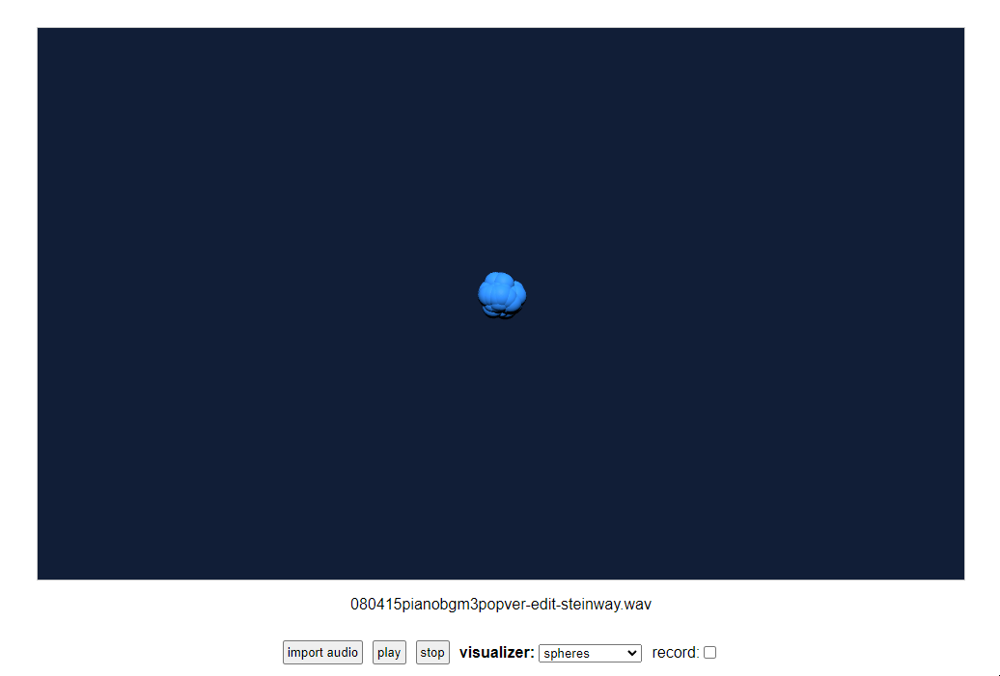

# music-visualizer-web    
A music visualizer web app that you can also record as .webm videos (including audio!).    
    
some examples:    
    
    
    

    
    
example result: https://youtu.be/YHuhptFvSMg?si=OtFU-lnNIJdyeNm9    
    
Not much to see yet but more to come! I'm trying to make something like [what I did with Unity](https://github.com/syncopika/music-visualizer) but with better recordability.    