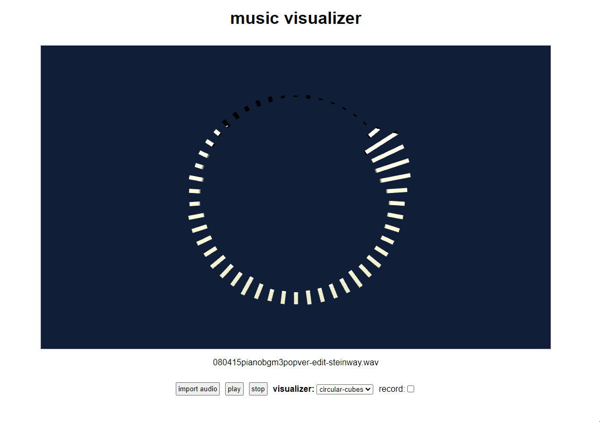
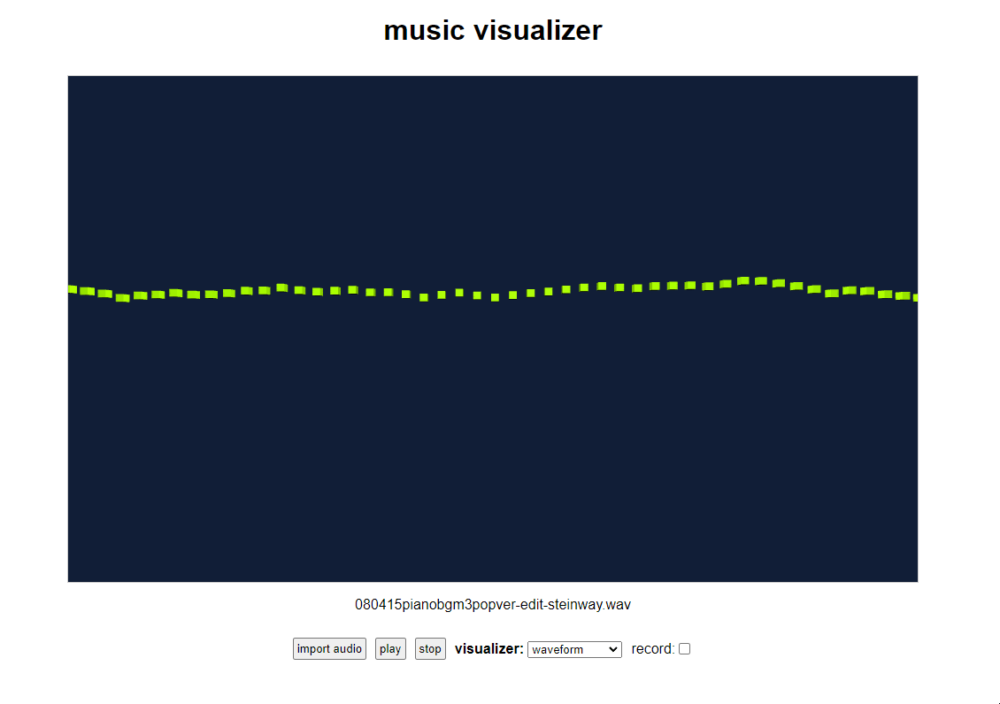

# music-visualizer-web    
A music visualizer web app that you can also record as .webm videos (but without audio atm).    
    
some examples:    
    
    
    
    
Not much to see yet but more to come! I'm trying to make something like [what I did with Unity](https://github.com/syncopika/music-visualizer) but with better recordability.    